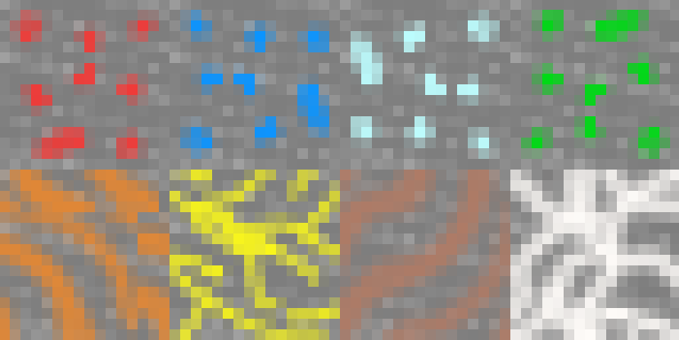

# Team Hopper
### Cranny, Fraser, Shen, Spearritt
## Critique 2

---

## Last time, on *Team Hopper*...

- Tile Engine
- Tile Generation
- Tile Persistence
- Tile Rendering
- Tile Interaction

---

## Since then...

- World Generation Pipeline (+Modifiers).
- Tile Engine improvements.
- More and better tests.
- Miscellaneous improvements.

--

### World Generation Pipeline (#88)

- Interface: `TileModifier`
- Implementations:
  - `SquareVeinTileModifier`
  - `PerlinVeinTileModifier`
- Also: `NoiseCreator`, for Perlin noise / fractal noise

Note:
- `NoiseCreator` uses Fractal Brownian Motion.

--

### Tile Engine

- Pipeline infrastructure
- FlyWay integration
- Refactoring

--

### Testing improvements

- Chunk rendering tested with PowerMock.
- Assorted tile testing improvements.

--

### Updated Textures

</img>

--

### Miscellaneous Improvements

- Documentation.
- Vertical mouse panning.
- Parallax effect for the sun.
- Window resizing work.

---

## Challenges

- Generating mineral veins - noise that 'looks right'.
- Testing randomness.
- Mouse panning: Rendering assumed fixed `Y` position.

Note:
- World had no concept of 'y offset'

---

## What's Next?

- World Gen improvements
    - More modifiers
- Lighting?

---

## Call for Feedback

- Texture Design - *Theming / Tessellation*
- Usability of Modifiers - *Usability*

---

## Questions?
