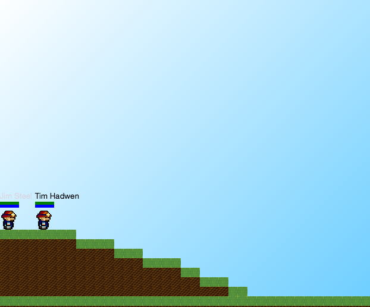

# Team Hopper
### Cranny, Fraser, Shen, Spearritt

---

## The Tile Engine


</img>


---

## Package: `tiles`

- `Tile`
- `TileChunk`
- `TileGridManager`

---

## Features

- Tile engine
- Generation
- Persistence
- Rendering
- Interaction

Note:
**Main things implemented are:**
- Core tile engine, The world is made of a grid of tiles
- World generation,
- Database Storage
- Rendering
- Interaction & collision

--

### Tile Engine

```java
world.manager = new TileGridManager(generator);
```

Note:
- World has TileGridManager.
- World made up of persistent 'Chunks'
- Each tile uses one byte of storage space

--

### Generation



--

## Persistence

<br/>

We saved the world!<br/>
<small>(We can destroy it too)</small>

--

### Rendering
<small>(No image available)</small>

Note: TileGridManager selects tiles to render intelligently

--

### Interaction


Note: Collisions and editing are possible

---

## Call for Feedback

- Ease of Interaction:
  - Adding new tile types?
  - Tile properties (e.g. mining)?
  - Modifying generator?