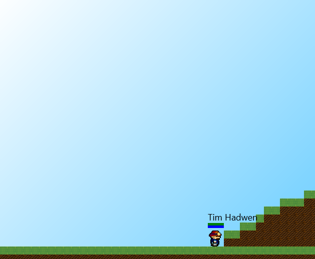

# Team Hopper
### Cranny, Fraser, Shen, Spearritt

---

## The Tile Engine


</img>


---

## Package: `tiles`

- `Tile`
- `TileChunk`
- `TileGridManager`

Note:
Our work is in the `tiles` package, primary elements: Tile enum, TileChunk class, TileGridManager class

---

## Features

- Tile engine
- Generation
- Persistence
- Rendering
- Interaction

Note:
**Main things implemented are:**
- Core tile engine, The world is made of a grid of tiles
- World generation,
- Database Storage
- Rendering
- Interaction & collision

--

### Tile Engine

```java
public enum Tile {
    AIR     ((byte)0, "Air", null, false),

    STONE   ((byte)1, "Stone", "texturepack/stone.png", true),
    GRASS   ((byte)2, "Grass", "texturepack/grass.png", true),
    DIRT    ((byte)3, "Dirt", "texturepack/dirt.png", true);

    private final byte id;
    private final String title;
    private final String texture;
    private final boolean solid;
	
	...
```

Note:
- World has TileGridManager.
- World made up of persistent 'Chunks'
- Each tile uses one byte of storage space; properties defined in enum
- Stateless!

--

### Generation


Note:
- Generation is extensible:
 - Object implementing `TileGenerator` interface passed into TGM constructor
 - Current `BasicGenerator` makes a flat floor, with rolling (sine wave) hills


--

## Persistence

<br/>

We saved the world!<br/>
<small>(we can destroy it too)</small>

Note:
- All tiles are persisted in the database (still being finalised)
- To be loaded in on game start (rather than regenerating each time)

--

### Rendering
<small>(No image available)</small>

```java

// If x is not within viewport, don't render this column
if ((chunkx+1) * CHUNK_GRID_SIZE * TILE_SIZE < xoffset
		|| (chunkx-1) * CHUNK_GRID_SIZE * TILE_SIZE > xoffset + screenWidth)
	continue;

// If y is not within viewport, don't render this chunk
if ((chunky+1) * CHUNK_GRID_SIZE * TILE_SIZE < yoffset
		|| (chunky-1) * CHUNK_GRID_SIZE * TILE_SIZE > yoffset + screenHeight)
	continue;

```

Note: 
- TileGridManager selects tiles to render intelligently (only within viewport)
- Unlike entities (currently) rendering performance is hence not tied to number of tiles
  - With current worldsize, there are ~40 chunks stored i.e. ~10000 tiles

--

### Interaction



Note:
- Collisions work much like with entities
 - Performance improvements by only checking tiles near entities
- Functionality for manipulating tiles (e.g. mining)
- Due to statelessness, more complex attributes must be added at 'mine-time'
  - Possible future goal: add consistent framework for doing this

---

## Tests

`TileTests`

`ChunkTests`

`TileGridManagerTests`

`BasicGeneratorTests`

Note:
- We have tests for each of our main classes, testing them in isolation
- Tests are good!

---

## Call for Feedback

- Ease of Interaction:
  - Adding new tile types?
  - Tile properties?
  - Modifying generator?
 
Note:
Since tiles form the backbone of what the world *is*, many different aspects interact with them.

Hence: our primary feedback concern is integration with other features. Feedback on interface points?:
	- Tile type creation
	- Interaction (mine-time properties)
	- Generator extensibility